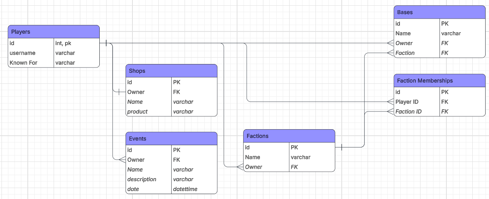

# mc-manager

A barebones Python TUI for managing a Minecraft server database. Lets you create and manage players, factions, bases, shops, and events.

---

## ERD



---

## Setup

**1. Install dependencies**
its just mysql-connector-python, but a requirements file is included
```bash
pip install -r requirements.txt
```

**2. Create the database**

Log into MySQL and run the schema:
```bash
mysql -u root -p < schema.sql
```

Or if your server is in Docker:
```bash
sudo docker exec -i <container_name> mysql -u root -p mc_manager < schema.sql
```

**3. Run the app**
```bash
python main.py
```

You'll be prompted for your MySQL username and password on startup.

---

## Tables

| Table | Description |
|---|---|
| `Players` | Stores player usernames and what they're known for |
| `Factions` | Groups of players with a name and an owner |
| `Faction_Memberships` | Junction table linking players to factions |
| `Bases` | Player or faction-owned bases, optionally tied to a faction |
| `Shops` | Player-run shops with a name and a product |
| `Events` | Server events with a name, description, date, and optional owner |

---

## Features

- Full CRUD on all 6 tables
- Confirmation prompt before any delete
- Foreign key relationships respected (e.g. deleting a player cascades to their shops, events, memberships)
- Nullable FK fields (shops and bases can exist without an owner)
- Parameterized queries throughout to prevent SQL injection
- Input validation on all ID fields, it rejects non-numeric input before hitting the DB
- Required field enforcement where empty strings are rejected on fields that can't be blank
- Failed writes roll back automatically so the DB is never left in a partial state, abides to ACID

---

## Example Usage

```
user: root
password:
```
```
mc manager
  1. players
  2. factions
  3. memberships
  4. bases
  5. shops
  6. events
  0. back
> 1

players
  1. list
  2. add
  3. update
  4. delete
  0. back
> 2
username: Notch
known for: creator of minecraft
ok

> 1

id | Username | Known_for
------------------------------------------------------------
1  | Notch    | creator of minecraft
```

Deleting a player:
```
> 4
player id: 1
delete player 1? y/n: y
ok
```

Invalid ID input:
```
> 4
player id: fish
invalid input: 'fish' is not a valid ID
```

Empty required field:
```
> 2
username: 
invalid input: field cannot be empty
```

---

## Known Bugs / Limitations

- `date` field on Events is a free-text input, no format enforcement beyond what MySQL rejects
- No pagination on list views, large tables will just dump everything to the terminal
- Credentials are entered in plaintext at startup, no config file support
- Only connects to `localhost` remote DB hosts require editing `database.py` directly
